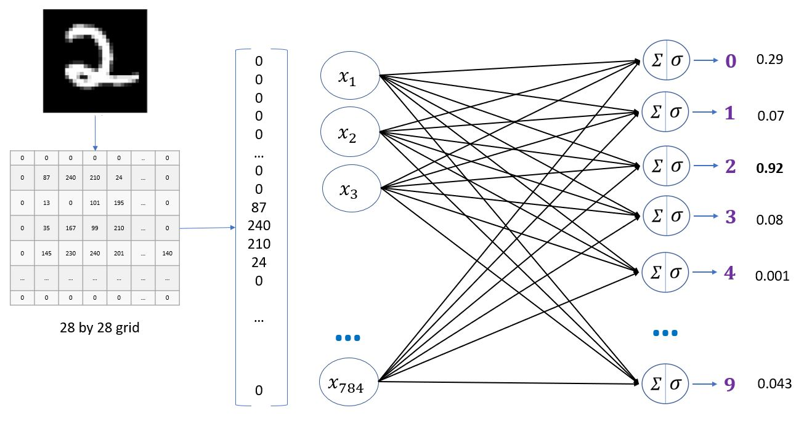

# Handwritten-Digits-Classification

In this notebook we will classify handwritten digits using a simple neural network which has only input and output layers. We will than add a hidden layer and see how the performance of the model improves.

<h3>Very simple neural network with no hidden layers.</h3>

Later, we will add the hidden layers to our model and then, will check whether the performance of the model improves or not.
